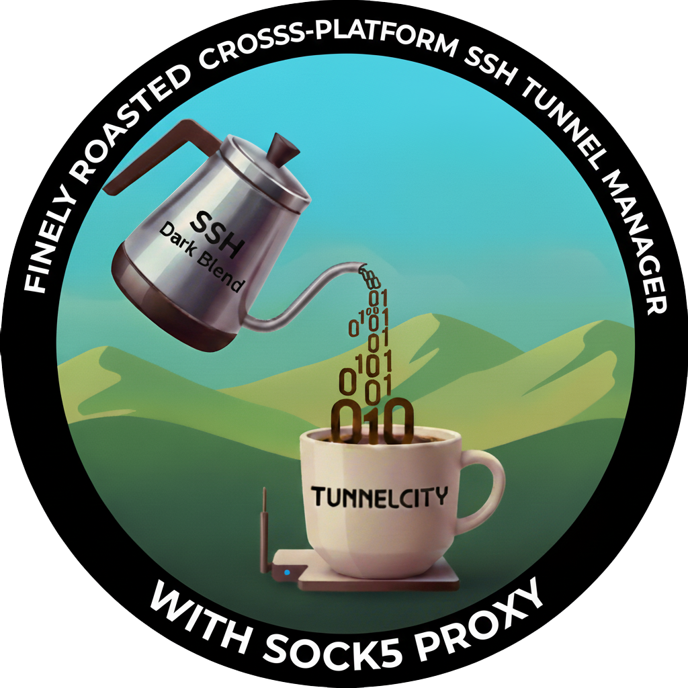

<p align="center">
  
</p>

# TunnelCity

Cross-platform SSH tunnel management scripts for creating SOCKS5 proxies through remote servers.

## Overview

TunnelCity provides easy-to-use scripts for establishing SSH tunnels with SOCKS5 proxy functionality. It supports both Unix-like systems (Linux, macOS) via bash and Windows systems via PowerShell.

## Features

- ✅ Cross-platform support (Bash + PowerShell)
- ✅ SOCKS5 proxy creation through SSH tunnels
- ✅ Background and foreground operation modes
- ✅ Process management and cleanup
- ✅ Connection testing and status monitoring
- ✅ Colored console output
- ✅ Environment-based configuration

## Installation

### Option 1: Download from GitHub (Recommended)

#### Using Git Clone
```bash
# Clone the repository
git clone https://github.com/mattbaya/tunnelcity.git
cd tunnelcity

# Make scripts executable (Unix/Linux/macOS only)
chmod +x tunnelcity.sh
```

#### Download ZIP
1. Visit https://github.com/mattbaya/tunnelcity
2. Click the green **Code** button
3. Select **Download ZIP**
4. Extract the files to your desired location
5. For Unix/Linux/macOS: `chmod +x tunnelcity.sh`

### Option 2: Direct Download
```bash
# Download individual files (Unix/Linux/macOS)
curl -O https://raw.githubusercontent.com/mattbaya/tunnelcity/main/tunnelcity.sh
curl -O https://raw.githubusercontent.com/mattbaya/tunnelcity/main/.env.example
chmod +x tunnelcity.sh

# Windows PowerShell
Invoke-WebRequest -Uri "https://raw.githubusercontent.com/mattbaya/tunnelcity/main/tunnelcity.ps1" -OutFile "tunnelcity.ps1"
Invoke-WebRequest -Uri "https://raw.githubusercontent.com/mattbaya/tunnelcity/main/.env.example" -OutFile ".env.example"
```

## Quick Start

### 1. Configure Your Environment

Create a `.env` file with your SSH connection details:

```bash
SSH_USER=your_username
SSH_HOST=your_remote_server
LOCAL_PORT=8080
```

### 2. Choose Your Platform

#### Unix/Linux/macOS (Bash)
```bash
# Make executable
chmod +x tunnelcity.sh

# Start tunnel in background
./tunnelcity.sh start-bg

# Check status
./tunnelcity.sh status
```

#### Windows 11 (PowerShell)
```powershell
# Start tunnel in background
.\tunnelcity.ps1 start-bg

# Check status
.\tunnelcity.ps1 status
```

## Usage

Both scripts support the same commands:

- `start` - Start tunnel in foreground (interactive mode)
- `start-bg` - Start tunnel in background
- `stop` - Stop the tunnel
- `status` - Show tunnel status
- `restart` - Restart the tunnel in background
- `test` - Test the tunnel connection
- `help` - Show help message

## Configuration

### Environment Variables

Create a `.env` file in the same directory as the scripts:

```bash
# SSH connection details
SSH_USER=your_username
SSH_HOST=your_remote_server.com
LOCAL_PORT=8080
```

### SSH Key Setup

Ensure you have SSH key authentication configured for passwordless login:

```bash
# Generate SSH key if you don't have one
ssh-keygen -t rsa -b 4096

# Copy key to remote server
ssh-copy-id your_username@your_remote_server.com

# Test connection
ssh your_username@your_remote_server.com
```

## Using the SOCKS5 Proxy

Once the tunnel is running, configure your applications to use:

- **Proxy Type**: SOCKS5
- **Host**: 127.0.0.1
- **Port**: 8080 (or your configured port)

### Browser Examples

**Chrome/Chromium**:
```bash
google-chrome --proxy-server="socks5://127.0.0.1:8080"
```

**Firefox**:
1. Settings → Network Settings
2. Manual proxy configuration
3. SOCKS Host: `127.0.0.1`, Port: `8080`
4. Select "SOCKS v5"

**curl**:
```bash
curl --socks5 127.0.0.1:8080 https://ifconfig.me
```

## OS-Level Proxy Configuration

TunnelCity includes comprehensive guides for configuring **system-wide proxies** at the operating system level:

### 🍎 **macOS System Proxy** ([README-macOS.md](README-macOS.md))
- **GUI**: System Preferences > Network > Advanced > Proxies
- **Command Line**: `networksetup` commands for automated control
- **Shell Functions**: Easy proxy toggle scripts
- **Network Location**: Automatic proxy switching

### 🪟 **Windows System Proxy** ([README-Windows.md](README-Windows.md))
- **GUI**: Settings > Network & Internet > Proxy
- **PowerShell**: Registry-based proxy management functions
- **Browser Configuration**: Chrome and Firefox setup
- **Comprehensive Setup**: OpenSSH Client installation and configuration

### 🐧 **Linux System Proxy** ([README-Linux.md](README-Linux.md))
- **Environment Variables**: Export proxy settings system-wide
- **Desktop Environments**: GNOME, KDE, XFCE configuration
- **Shell Functions**: Easy proxy toggle commands
- **Browser Configuration**: Firefox and Chrome setup

### Quick OS Proxy Commands:

**macOS**:
```bash
# Enable
sudo networksetup -setsocksfirewallproxy "Wi-Fi" 127.0.0.1 8080

# Disable
sudo networksetup -setsocksfirewallproxystate "Wi-Fi" off
```

**Windows**:
```powershell
# Enable
Set-ItemProperty -Path "HKCU:\Software\Microsoft\Windows\CurrentVersion\Internet Settings" -Name ProxyEnable -Value 1

# Disable
Set-ItemProperty -Path "HKCU:\Software\Microsoft\Windows\CurrentVersion\Internet Settings" -Name ProxyEnable -Value 0
```

**Linux**:
```bash
# Enable
export ALL_PROXY=socks5://127.0.0.1:8080

# Disable
unset ALL_PROXY
```

## Platform-Specific Setup

### Windows Requirements

1. **OpenSSH Client**: Install via Windows Features or Git for Windows
2. **PowerShell Execution Policy**:
   ```powershell
   Set-ExecutionPolicy -ExecutionPolicy RemoteSigned -Scope CurrentUser
   ```

See [README-Windows.md](README-Windows.md) for detailed Windows setup instructions and **system-wide proxy configuration**.

### macOS Requirements

- SSH client (pre-installed)
- Bash shell
- Standard Unix utilities (ps, kill, etc.)

See [README-macOS.md](README-macOS.md) for detailed macOS setup instructions and **system-wide proxy configuration**.

### Linux Requirements

- SSH client (usually pre-installed)
- Bash shell
- Standard Unix utilities (ps, kill, etc.)

See [README-Linux.md](README-Linux.md) for detailed Linux setup instructions and **system-wide proxy configuration**.

## Troubleshooting

### Common Issues

**Connection Refused**:
- Verify SSH key authentication works
- Check if remote server is accessible
- Ensure local port is not already in use

**Permission Denied**:
- Verify SSH key permissions (600 for private key)
- Check SSH agent is running and key is loaded

**Script Execution Issues**:
- **Bash**: Ensure script is executable (`chmod +x tunnelcity.sh`)
- **PowerShell**: Set execution policy as described above

**Channel Connection Errors**:
- "channel X: open failed" messages are normal when applications try to connect to blocked/refused destinations
- These are suppressed in the updated scripts with `LogLevel=ERROR`
- See [TROUBLESHOOTING.md](TROUBLESHOOTING.md) for detailed analysis

### Testing Connectivity

```bash
# Test direct SSH connection
ssh your_username@your_remote_server.com

# Test tunnel (after starting)
./tunnelcity.sh test  # or .\tunnelcity.ps1 test
```

For comprehensive troubleshooting information, see [TROUBLESHOOTING.md](TROUBLESHOOTING.md).

## Security Considerations

- Use SSH key authentication only (never passwords)
- Keep private keys secure and properly permissioned
- Use strong passphrases for SSH keys
- Regularly rotate SSH keys
- Monitor tunnel usage and logs

## Contributing

1. Fork the repository
2. Create a feature branch
3. Make changes ensuring cross-platform compatibility
4. Test on both bash and PowerShell
5. Submit a pull request

## License

MIT License - see LICENSE file for details.